# 🔐 AWS Security Hardening & Cost Optimization


> A hands-on AWS project focused on identifying security misconfigurations, applying AWS security best practices, validating remediation, and improving cloud cost visibility.

---

## 📌 Project Overview

This project demonstrates a practical AWS Security Audit, Hardening, and Cost Optimization workflow.

The AWS environment was reviewed for common security weaknesses across:

- IAM
- Amazon S3
- Amazon EC2
- Amazon EBS
- Security Groups
- AWS Config
- AWS CloudTrail
- AWS Cost Explorer
- AWS Budgets

The identified security issues were remediated and validated using before-and-after evidence.

### Project Workflow

**Audit → Identify → Remediate → Validate → Monitor → Optimize**

---

# 🎯 Project Objectives

- Audit AWS resources for security misconfigurations
- Enable MFA for IAM users
- Review overly permissive IAM policies
- Apply least-privilege access
- Secure S3 public access
- Restrict unnecessary Security Group access
- Enable EBS encryption
- Configure AWS Config
- Review CloudTrail logging
- Analyze AWS costs
- Configure AWS Budgets
- Validate security improvements

---

# 🏗️ AWS Security Architecture

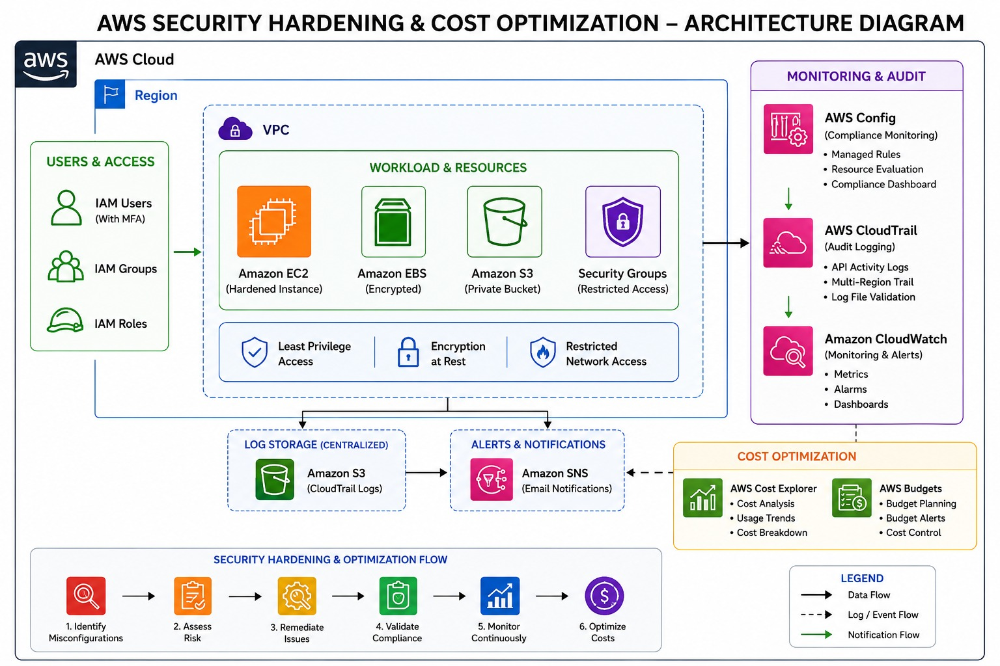

---

# 🔍 Security Audit & Remediation

## 1. IAM MFA Security

### Before

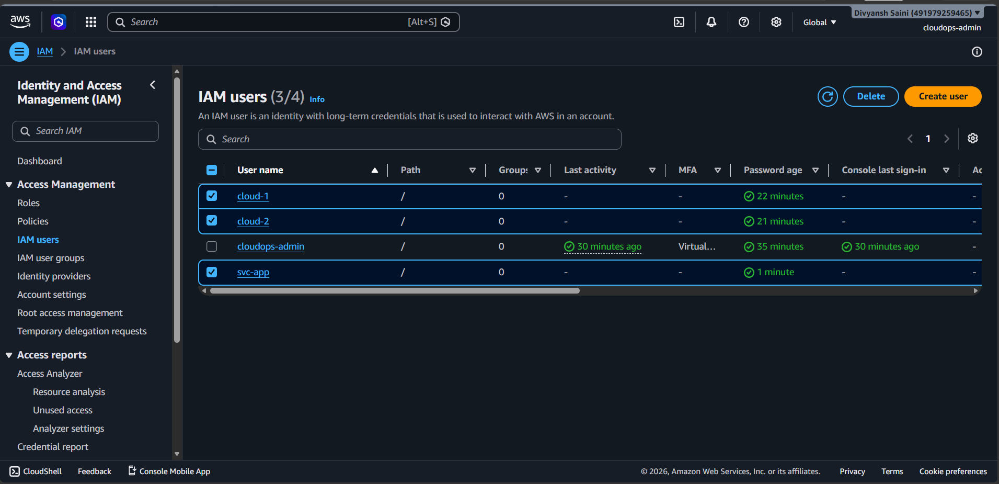

### After

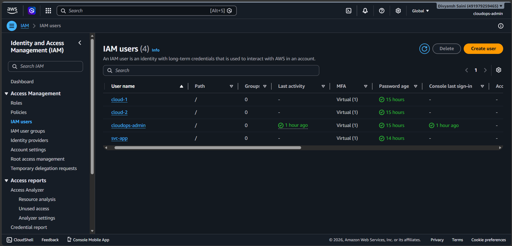

**Improvement:** Multi-Factor Authentication was enabled for the identified IAM users.

---

## 2. IAM Policy Security

### Before

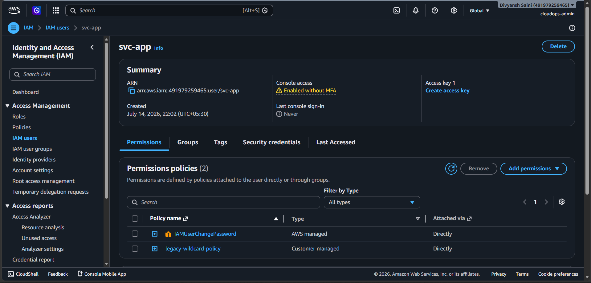

### After

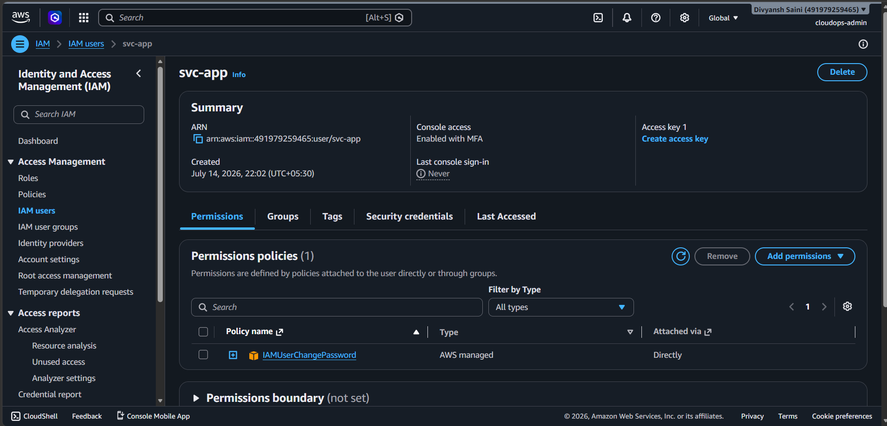

**Improvement:** Excessive IAM permissions were reviewed and restricted according to the principle of least privilege.

---

## 3. Amazon S3 Public Access

### Before

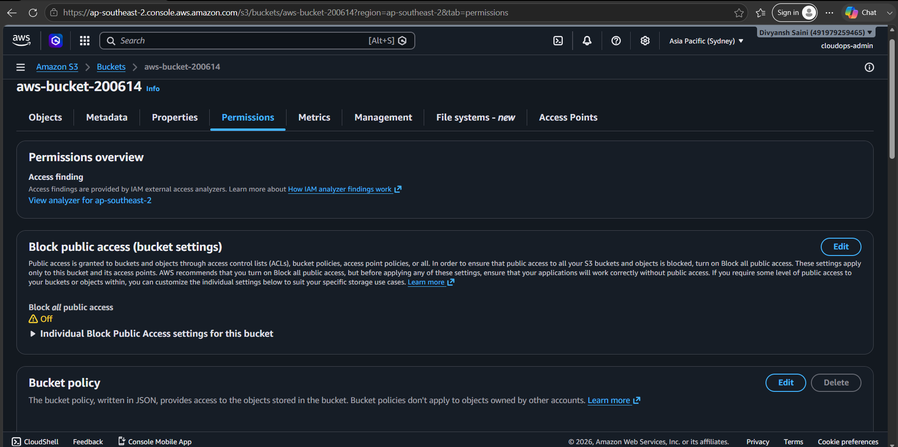

### After


**Improvement:** Public access was removed to reduce the risk of unauthorized access to S3 resources.

---

## 4. EC2 Security Group

### Before

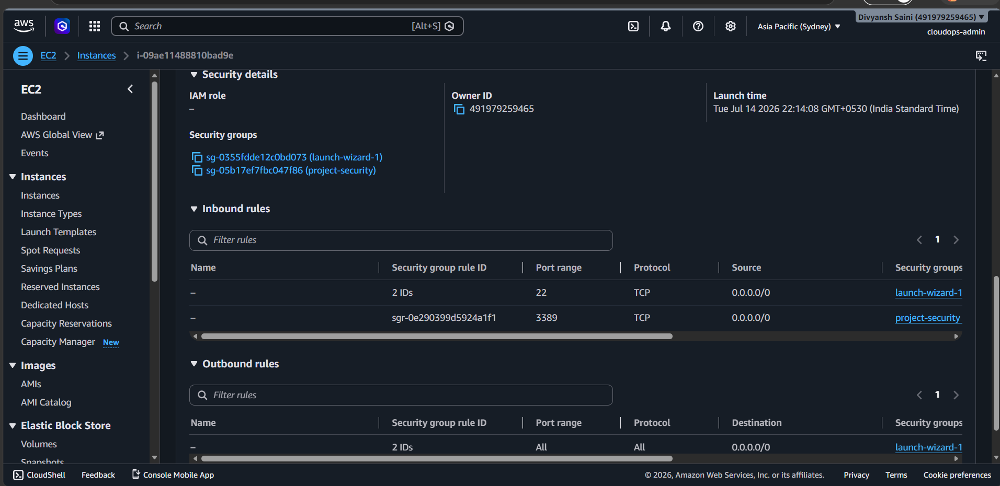

### After

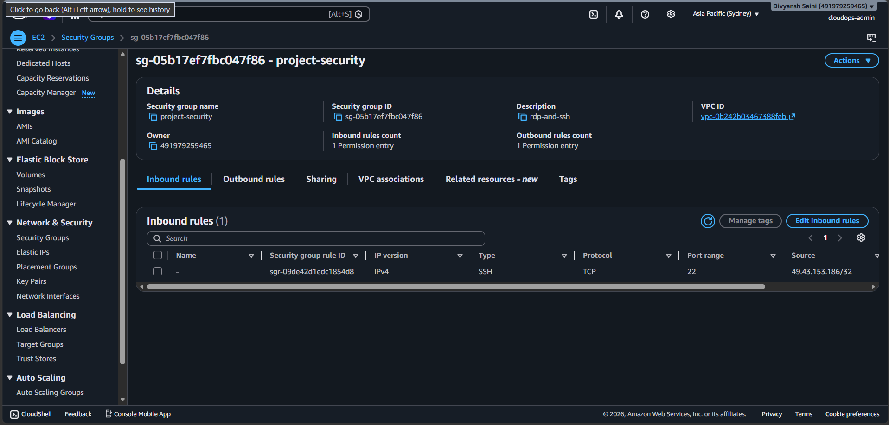

**Improvement:** Unnecessary inbound access was restricted to reduce network exposure.

---

## 5. Amazon EBS Encryption

### Before

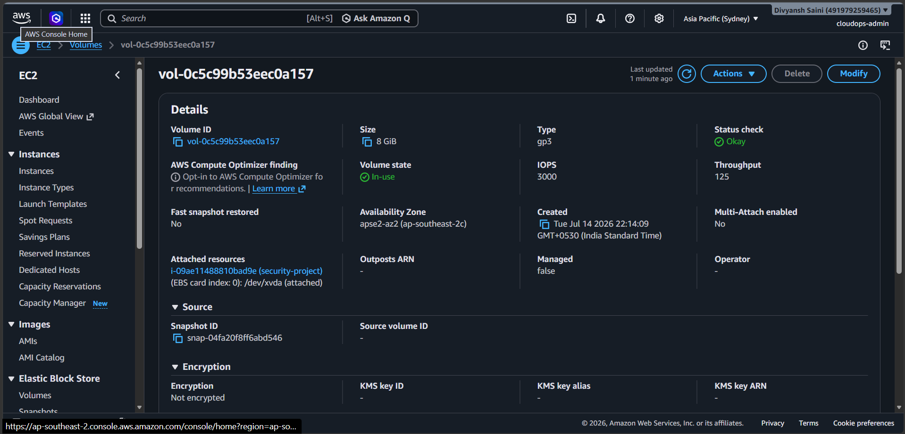

### After

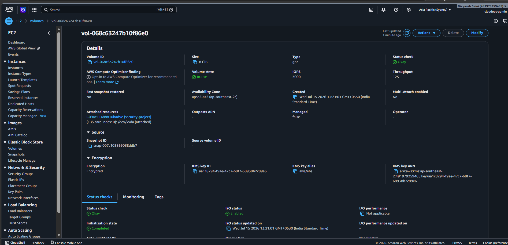

**Improvement:** EBS encryption was enabled to protect data at rest.

---

# 🛡️ AWS Config

AWS Config was used to review AWS resource configurations and validate security-related settings.

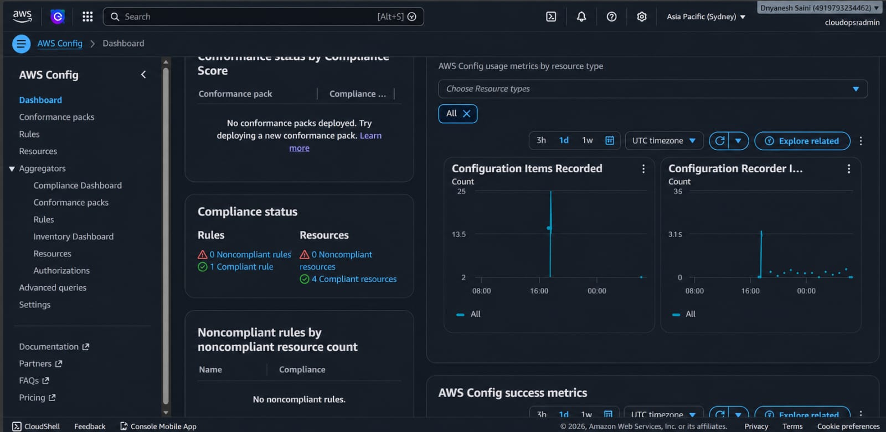

### Areas Reviewed

- IAM configuration
- MFA compliance
- EBS encryption
- Resource configuration
- Security compliance

---

# 📜 AWS CloudTrail

CloudTrail logging was reviewed to provide visibility into AWS API activity and account-level actions.

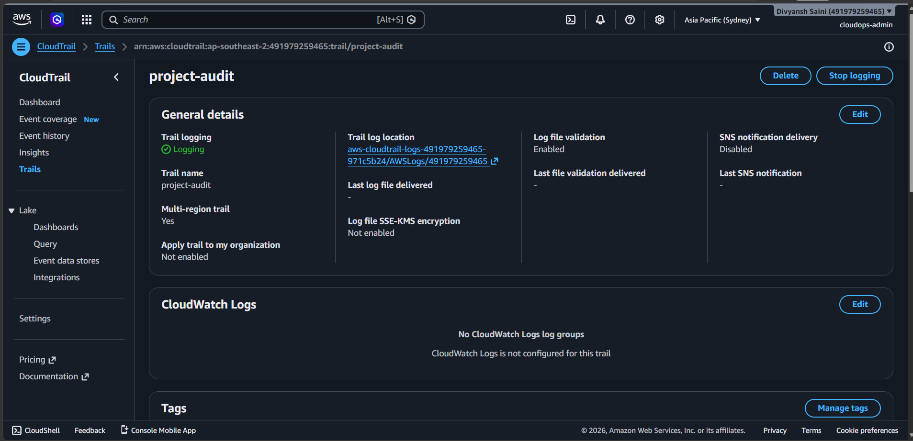

### CloudTrail Provides Visibility Into

- API activity
- User actions
- Resource changes
- Account activity
- Security investigations
- Audit activity

---

# 💰 Cost Optimization

The project also focused on improving AWS cost visibility and introducing basic cost governance.

---

## 📊 AWS Cost Explorer

AWS Cost Explorer was used to analyze AWS spending and identify cost trends.

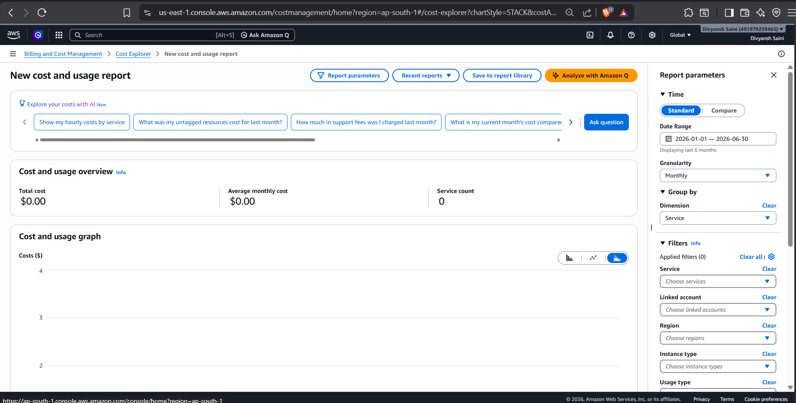

### Cost Analysis

- AWS spending
- Cost trends
- Forecasted costs
- Service-level costs
- Cost optimization opportunities

---

## 💵 AWS Budget

An AWS Budget was configured to monitor cloud spending and track defined cost thresholds.

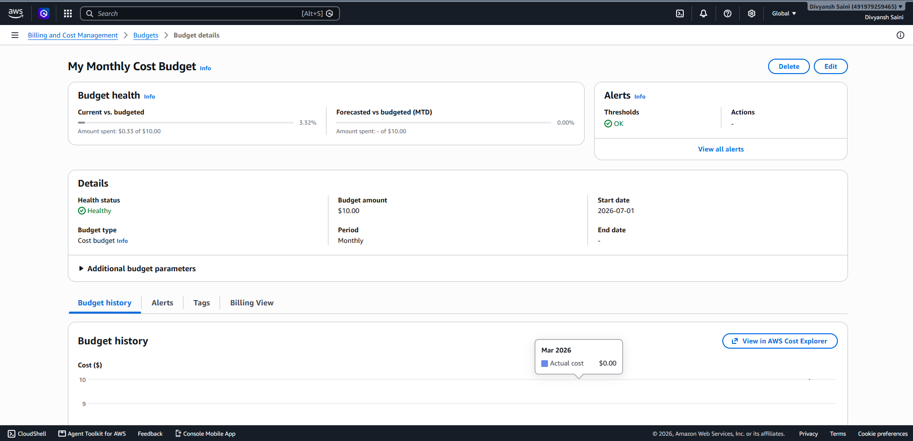

### Cost Monitoring Workflow

**AWS Usage → Cost Explorer → Cost Analysis → AWS Budget → Threshold Monitoring**

---

# 📊 Before & After Security Evidence

The repository contains visual evidence of the security improvements implemented during the project.

| Security Area | Before | After |
|---|---|---|
| IAM MFA | MFA not enabled | MFA enabled |
| IAM Policy | Excessive permissions | Permissions restricted |
| S3 | Public access | Public access removed |
| Security Group | Open inbound access | Restricted access |
| EBS | Encryption not enabled | Encryption enabled |

---

# 🖼️ Before Security Configuration

### IAM Without MFA


### Overly Permissive IAM Policy


### Public S3 Bucket


### Open Security Group


### Unencrypted EBS Volume


---

# 🖼️ After Security Configuration

### IAM MFA Enabled


### IAM Policy Restricted


### S3 Public Access Removed


### Security Group Restricted


### EBS Encryption Enabled


---

# 📈 Monitoring & Compliance Evidence

## AWS Config


## AWS CloudTrail


## AWS Cost Explorer


## AWS Budget


---

# 🧰 AWS Services Used

| AWS Service | Purpose |
|---|---|
| AWS IAM | Identity and access management |
| IAM MFA | Multi-factor authentication |
| Amazon S3 | Secure object storage |
| Amazon EC2 | Compute infrastructure |
| Amazon EBS | Block storage and encryption |
| Security Groups | Network access control |
| AWS Config | Configuration and compliance monitoring |
| AWS CloudTrail | API activity and auditing |
| AWS Cost Explorer | Cost analysis |
| AWS Budgets | Cost monitoring |

---

# 🔐 Security Controls Implemented

### Identity & Access

- MFA enabled
- IAM policies reviewed
- Excessive permissions restricted
- Least-privilege access applied

### Data Protection

- EBS encryption enabled
- S3 public access removed
- Storage configuration reviewed

### Network Security

- Security Group rules reviewed
- Unnecessary inbound access restricted

### Monitoring

- AWS Config reviewed
- CloudTrail logging reviewed
- Security configuration validated

### Cost Management

- AWS Cost Explorer used
- AWS Budget configured
- Cost thresholds monitored

---

# 🧪 Validation Checklist

- [x] IAM MFA reviewed
- [x] IAM permissions reviewed
- [x] S3 public access removed
- [x] Security Group rules restricted
- [x] EBS encryption enabled
- [x] AWS Config reviewed
- [x] CloudTrail logging reviewed
- [x] Cost Explorer reviewed
- [x] AWS Budget configured

---

# 📁 Repository Structure

```text
aws-security-hardening-cost-optimization/
│
├── After/
│   ├── after-ebs-encrypted.png
│   ├── after-iam-mfa-enabled.png
│   ├── after-iam-policy-restricted.png
│   ├── after-s3-public-access-removed.png
│   ├── after-security-group-restricted.png
│   ├── aws-config.jpeg
│   └── aws-cost-explorer.png
│
├── Architecture/
│   └── aws-security-architecture.jpeg
│
├── Before/
│   ├── before-ebs-volume.png
│   ├── before-iam-without-mfa.png
│   ├── before-open-security-group.png
│   ├── before-overly-permissive-iam-policy.png
│   ├── before-public-s3-bucket.png
│   └── cloudtrail-logging.png
│
├── Cost/
│   └── aws-budget.png
│
└── README.md
